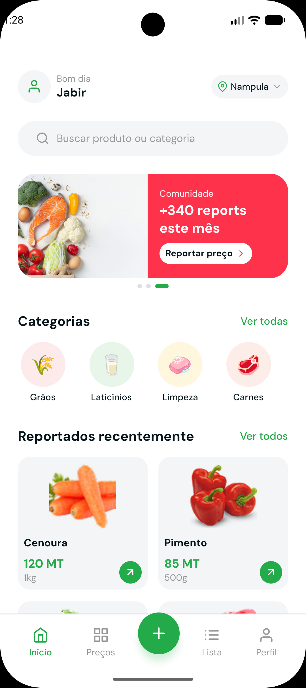
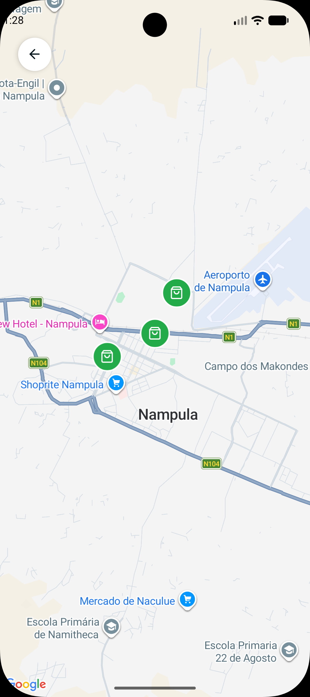
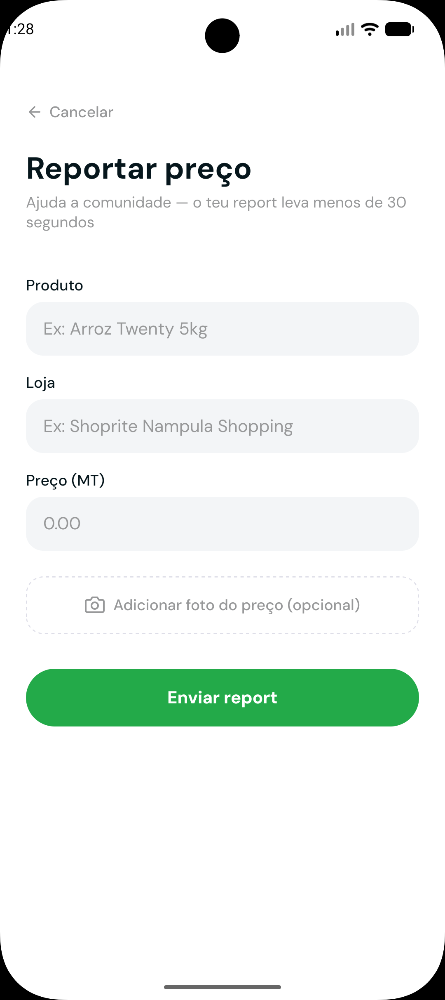
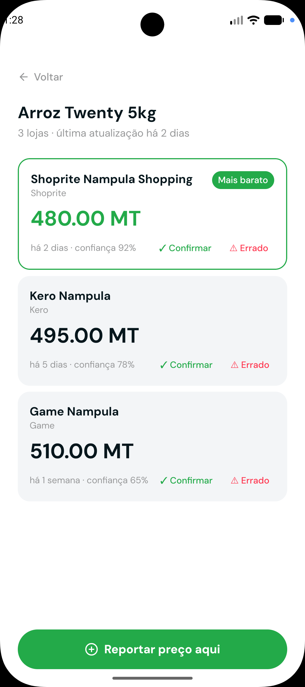
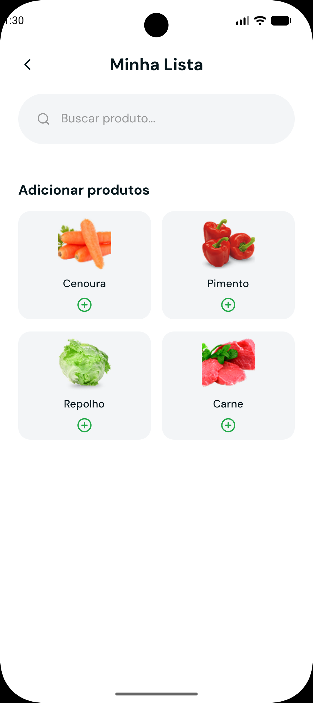
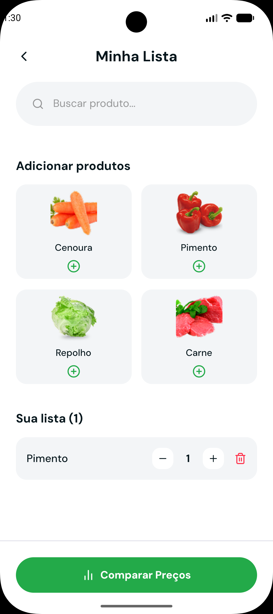
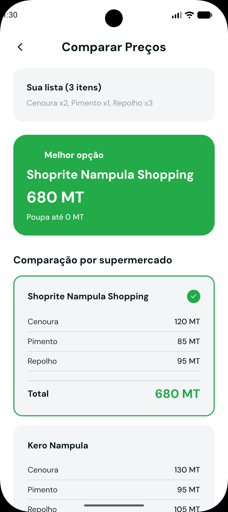

<div align="center">

  

</div>

# Koshukuro 🛒

<div align="center">


**Um aplicativo mobile inteligente para comparação de preços de produtos em supermercados**

[Live Demo](#) • [Report Bug](#) • [Request Feature](#)

</div>

---

## Sobre o Projeto

O **Koshukuro** é um aplicativo mobile desenvolvido com React Native e Expo que permite aos usuários comparar preços de produtos em diferentes supermercados, visualizar localizações em mapa interativo, criar listas de compras e reportar preços. O aplicativo integra autenticação Google, serviços de mapa e localização, proporcionando uma experiência completa de comparação de preços.

### Objetivo

Facilitar a vida dos consumidores ao fornecer uma plataforma intuitiva para pesquisa e comparação de preços, ajudando a economizar dinheiro e tempo nas compras do dia a dia.

---

## Funcionalidades

### 🔐 Autenticação
- **Login com Google**: Integração segura com Google Sign-In
- **Sessão Persistente**: Mantém o usuário autenticado entre sessões
- **Splash Screen**: Experiência de carregamento profissional

### Home
- **Banner Carousel**: Apresentação visual de promoções e destaques
- **Navegação Intuitiva**: Acesso rápido a todas as funcionalidades
- **Design Responsivo**: Interface adaptável a diferentes tamanhos de tela

### Comparação de Preços
- **Visualização de Preços**: Compara preços do mesmo produto em diferentes lojas
- **Cards de Preço**: Componentes reutilizáveis para exibição de informações
- **Detalhes do Produto**: Informações completas sobre cada item

### 🗺️ Mapa Interativo
- **Localização de Lojas**: Visualização geográfica de supermercados
- **Integração Google Maps**: API de mapas robusta e precisa
- **Localização do Usuário**: Serviços de geolocalização em tempo real

### Lista de Compras
- **Gerenciamento de Lista**: Adicione e remova itens da sua lista
- **Organização**: Estrutura simples e eficiente para planejamento
- **Persistência de Dados**: Mantém sua lista salva

### Reportar Preços
- **Contribuição Comunitária**: Usuários podem reportar preços encontrados
- **Formulário Intuitivo**: Interface fácil para preenchimento de informações
- **Validação de Dados**: Garantia de qualidade nas informações

### Perfil
- **Gerenciamento de Conta**: Informações do usuário e configurações
- **Personalização**: Opções de personalização da experiência

### Tema
- **Suporte a Temas**: Sistema de tema claro/escuro
- **Context API**: Gerenciamento de estado eficiente
- **Paleta de Cores Personalizada**: Design system consistente

---

## Tecnologias Utilizadas

### Frontend & Mobile
- **React Native 0.86.0**: Framework principal para desenvolvimento mobile
- **Expo 57.0.4**: Plataforma de desenvolvimento e build
- **TypeScript 6.0.3**: Tipagem estática para JavaScript
- **React 19.2.3**: Biblioteca UI base

### Autenticação & Backend
- **Firebase Auth 25.1.0**: Serviço de autenticação
- **Google Sign-In 16.1.2**: Autenticação social
- **Firebase App 25.1.0**: Core do Firebase

### Maps & Location
- **React Native Maps 1.27.2**: Integração de mapas
- **Expo Location 57.0.2**: Serviços de geolocalização
- **Google Maps API**: Serviços de mapa e geocoding

### UI & Styling
- **Expo Vector Icons 15.0.2**: Biblioteca de ícones
- **Expo Font 57.0.0**: Gerenciamento de fontes
- **DM Sans Font**: Tipografia moderna e legível
- **React Native Safe Area Context 5.7.0**: Áreas seguras em dispositivos

### Development Tools
- **Expo Dev Client 57.0.6**: Ambiente de desenvolvimento
- **TypeScript types**: Definições de tipos React

---

## Estrutura do Projeto

```
koshukuro/
├── assets/              # Imagens, ícones e recursos estáticos
├── components/          # Componentes reutilizáveis
│   ├── Bannercarousel.tsx
│   ├── Bottomtabbar.tsx
│   ├── PriceCard.tsx
│   ├── SplashScreen.tsx
│   └── StoreCard.tsx
├── context/            # Context API para gerenciamento de estado
│   └── ThemeContext.tsx
├── screens/            # Telas do aplicativo
│   ├── ComparePricesScreen.tsx
│   ├── HomeScreen.tsx
│   ├── MapScreen.tsx
│   ├── ProductPricesScreen.tsx
│   ├── ProfileScreen.tsx
│   ├── ReportPriceScreen.tsx
│   ├── ShoppingListScreen.tsx
│   └── SignInScreen.tsx
├── theme/              # Configurações de tema e estilos
│   ├── colors.ts
│   └── typography.ts
├── App.tsx             # Componente principal
├── package.json        # Dependências do projeto
├── app.json           # Configuração do Expo
└── tsconfig.json      # Configuração do TypeScript
```

---

## Como Instalar e Executar

### Pré-requisitos

- Node.js (v18 ou superior)
- npm ou yarn
- Expo CLI: `npm install -g expo-cli`
- Expo Go app no dispositivo mobile (Android/iOS)
- Conta Google para autenticação

### Instalação

1. **Clone o repositório**
```bash
git clone https://github.com/Jabirmussa/koshukuro.git
cd koshukuro
```

2. **Instale as dependências**
```bash
npm install
```

3. **Configure as variáveis de ambiente**
```bash
# Crie um arquivo .env baseado no .env.example
cp .env.example .env

# Edite o arquivo .env com suas chaves de API
# EXPO_PUBLIC_GOOGLE_WEB_CLIENT_ID=seu_client_id_aqui
```

4. **Configure Android SDK (Windows)**
```bash
# Defina as variáveis de ambiente do Android SDK
# No PowerShell:
$env:ANDROID_HOME = "C:\Users\SEU_USUARIO\AppData\Local\Android\Sdk"
$env:ANDROID_SDK_ROOT = "C:\Users\SEU_USUARIO\AppData\Local\Android\Sdk"

# Ou use os scripts fornecidos:
# PowerShell: .\start.ps1
# Batch: start.bat
```

### Execução

**Modo Desenvolvimento (Expo Go)**
```bash
npm start
```
Escaneie o QR code com o app Expo Go no seu dispositivo.

**Modo Desenvolvimento (Expo Dev Client)**
```bash
npm run android  # Para Android
npm run ios      # Para iOS
```

**Modo Web**
```bash
npm run web
```

**Scripts de Inicialização**
```bash
# PowerShell (recomendado para Windows)
.\start.ps1

# Batch (alternativa para Windows)
start.bat
```

---

## Configuração

### Variáveis de Ambiente

O projeto requer configuração dos seguintes serviços:

1. **Firebase Console**
   - Crie um projeto no Firebase Console
   - Configure Authentication com Google Sign-In
   - Obtenha o arquivo `google-services.json` para Android
   - Obtenha o arquivo `GoogleService-Info.plist` para iOS

2. **Google Maps API**
   - Ative a Google Maps JavaScript API
   - Ative a Google Places API
   - Adicione a API key no `app.json`

3. **Google Cloud Console**
   - Configure OAuth 2.0 Client IDs
   - Adicione o package name do app Android
   - Configure consent screen para OAuth

### Arquivos de Configuração

Os arquivos sensíveis (chaves de API, arquivos de configuração do Firebase) estão protegidos no `.gitignore` e não são incluídos no repositório público.

---

## Design System

### Cores
- **Primary**: `#E6F4FE` (Azul claro)
- **Secondary**: Cores do tema claro/escuro
- **Accent**: Cores de destaque para ações principais

### Tipografia
- **Font Family**: DM Sans
- **Weights**: 400 (Regular), 500 (Medium), 700 (Bold)

### Componentes
- **PriceCard**: Exibição de preços com estilo consistente
- **StoreCard**: Informações de lojas com visual atraente
- **BannerCarousel**: Carrossel de banners com navegação

---

## Screenshots

<div align="center">

### Home Screen


### Product Search


### Map Screen


### Price Comparison


### Shopping List


### Report Price


### Profile Screen


### Sign In Screen


</div>

---

## Funcionalidades Futuras

- [ ] Integração com API de preços em tempo real
- [ ] Sistema de notificações para promoções
- [ ] Histórico de preços com gráficos
- [ ] Modo offline com cache local
- [ ] Integração com listas de compra compartilhadas
- [ ] Scanner de código de barras
- [ ] Sistema de avaliações de lojas
- [ ] Recomendações baseadas em histórico

---

## Contribuindo

Contribuições são bem-vindas! Para contribuir:

1. Fork o projeto
2. Crie uma branch para sua feature (`git checkout -b feature/AmazingFeature`)
3. Commit suas mudanças (`git commit -m 'Add some AmazingFeature'`)
4. Push para a branch (`git push origin feature/AmazingFeature`)
5. Abra um Pull Request

### Diretrizes de Contribuição
- Siga o padrão de código existente
- Adicione testes para novas funcionalidades
- Atualize a documentação conforme necessário
- Respeite o estilo de código e formatação

---

## Licença

Este projeto está sob a licença MIT. Veja o arquivo `LICENSE` para mais detalhes.

---

## Autor

**Jabir Mussa**

- GitHub: [@Jabirmussa](https://github.com/Jabirmussa)

---

## Agradecimentos

- [Expo](https://expo.dev/) - Plataforma de desenvolvimento mobile
- [React Native](https://reactnative.dev/) - Framework mobile
- [Firebase](https://firebase.google.com/) - Serviços de backend
- [Google Maps Platform](https://developers.google.com/maps) - Serviços de mapa

---


<div align="center">

**Se este projeto ajudou você, considere dar uma estrela! ⭐**

Made with ❤️ by [Jabirmussa](https://github.com/Jabirmussa)

</div>
